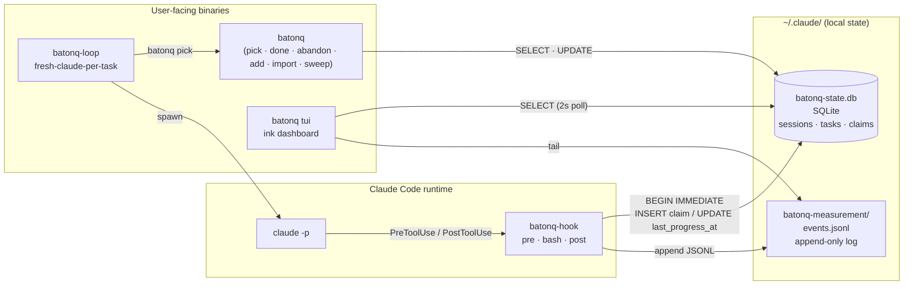
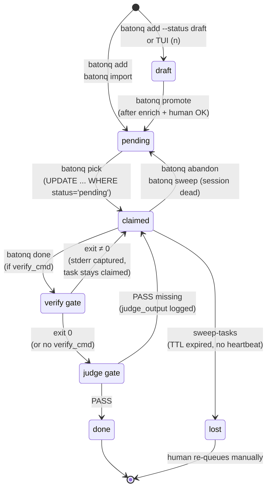
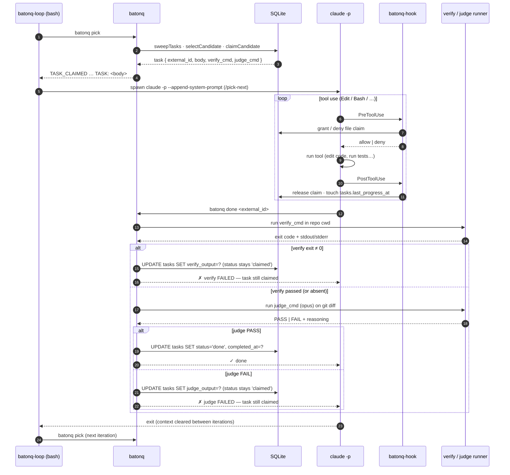

# Architecture

batonq is three files and a handful of verbs. This document zooms in on the
pieces: how the binaries talk to state, how a task moves through its
lifecycle, how claims are granted without two agents colliding, and how a
full `pick → done` run flows end-to-end.

## 1. Components



The diagram separates three concerns that stay separate in the code as well.
**State** lives in two files: a SQLite DB (`batonq-state.db`) holding the
three tables (`sessions`, `tasks`, `claims`) under ACID transactions, and an
append-only JSONL event log (`events.jsonl`) that anything can `tail -F`.
**Claude Code** drives the hook via its PreToolUse and PostToolUse callbacks;
the hook never calls back into Claude. **User-facing binaries** are clients
of the two state files: the CLI (`batonq`) runs one-shot verbs, the TUI polls
the DB every two seconds for a live view, and `batonq-loop` is a thin bash
wrapper that alternates `batonq pick` with a fresh `claude -p` invocation per
task. The arrows are intentionally one-way: the hook writes, the TUI reads,
the CLI does both but never talks to the hook directly. If the DB is
unreachable the hook fails open — Claude's tool call still runs, it just
won't be coordinated.

## 2. Task lifecycle



A task always lives in exactly one of five statuses. `draft` is the pre-spec
lane — the TUI's `n` keybind and `batonq add --status draft` put work here,
and `selectCandidate` hard-filters drafts out so an autonomous agent can
never claim one. `pending` means ready-to-pick. `claimed` means a session's
PID owns it; `last_progress_at` is refreshed by the PostToolUse hook so
active work keeps the claim warm. `done` and `lost` are terminal. The two
gates between `claimed` and `done` are a key invariant: `verify` is a shell
command whose non-zero exit keeps the task claimed rather than closing it,
and `judge` is an optional LLM review whose non-PASS verdict likewise keeps
it claimed. Neither gate is skippable (the `--skip-verify` / `--skip-judge`
flags were removed on 2026-04-23). The `lost` transition fires from
`batonq sweep-tasks` when a claim's progress TTL expires without a live
heartbeat — it is an escalation, not a graceful exit, and shows up in
`/tmp/batonq-escalations.log` for a human to re-queue.

## 3. Write path for file claims

```mermaid
sequenceDiagram
    autonumber
    participant CC as claude -p
    participant H as batonq-hook (pre)
    participant DB as SQLite (claims)

    CC->>H: PreToolUse { tool: Edit, paths: [src/app.ts] }
    H->>DB: touchSession · sweepStale · refreshHolderClaims
    H->>DB: BEGIN IMMEDIATE
    Note over DB: write-lock acquired;<br/>other writers block here
    H->>DB: SELECT * FROM claims<br/>WHERE fingerprint=? AND file_path=?<br/>AND released_at IS NULL
    alt active claim held by peer
      H->>DB: ROLLBACK
      H-->>CC: { permissionDecision: "deny",<br/>reason: "held by session abc123…" }
    else no conflict
      H->>DB: INSERT INTO claims (…, released_at=NULL)
      Note over DB: UNIQUE partial index<br/>idx_active_claim(fingerprint, file_path)<br/>WHERE released_at IS NULL<br/>→ second writer racing us<br/>hits constraint, rolls back
      H->>DB: COMMIT
      H-->>CC: (no output → allow)
    end
    CC->>CC: run Edit tool
    CC->>H: PostToolUse
    H->>DB: UPDATE claims SET released_at=?, release_hash=?<br/>WHERE session_id=? AND released_at IS NULL
```

The write path combines two defences. First, every claim-granting
transaction starts with `BEGIN IMMEDIATE`, which acquires SQLite's write
lock up front instead of on first write — so two hooks running at the same
instant serialise at step 3 rather than racing to step 4 and hitting the
busy handler mid-commit. Second, the `claims` table carries a **unique
partial index** on `(fingerprint, file_path) WHERE released_at IS NULL`.
Even if the SELECT-then-INSERT check-and-act pattern were somehow
short-circuited, a duplicate live claim can't physically land in the table
— the index rejects the second insert at commit time. Released claims
(`released_at IS NOT NULL`) drop out of the partial index, so the same
file can be re-claimed freely after a PostToolUse release. The hook fails
open on any exception: a ROLLBACK wrapped in `try`, and the tool call is
allowed to proceed. Worst case the coordination silently degrades; the
edit never gets blocked by a bug in the hook itself.

## 4. Data flow: agent runs a task



End-to-end, one pass of the loop is: `batonq-loop` asks the CLI for a
claim, the CLI atomically flips one `pending` row to `claimed` and prints
the task body to stdout, and bash pipes that into a fresh `claude -p`
with the `/pick-next` system prompt appended. Claude then edits files;
each Edit/Write/MultiEdit round-trips through the hook, which grants a
file lock in the claims table (see §3) and — on the way back out —
releases it and bumps `tasks.last_progress_at` so the sweep doesn't
reclaim the task from under a live agent. When Claude finishes it calls
`batonq done <id>`, which runs the `verify_cmd` inside the repo checkout;
a non-zero exit keeps the task claimed so a subsequent pick can re-try
after a fix. If `verify` passes, the `judge_cmd` is handed to opus along
with the `git diff`; only a `PASS` verdict flips the row to `done`. The
Claude process then exits, context is implicitly cleared by the fresh
spawn, and the loop rolls to the next task. Everything a human would want
to audit is in two files: the DB row's `verify_output` / `judge_output`
columns for the gates, and `events.jsonl` for the hook-level tool trace.
